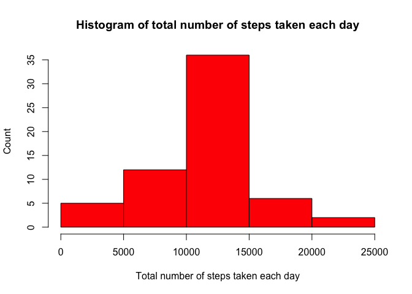

# Data loading 


```r
# open zip file
file <- unzip("activity.zip", files = NULL, list = FALSE, overwrite = TRUE,
              junkpaths = FALSE, exdir = ".", unzip = "internal",
              setTimes = FALSE)
# load data
activity <- read.csv("activity.csv", sep = ",", header = TRUE)

# check the first rows
head(activity)
```

```
##   steps       date interval
## 1    NA 2012-10-01        0
## 2    NA 2012-10-01        5
## 3    NA 2012-10-01       10
## 4    NA 2012-10-01       15
## 5    NA 2012-10-01       20
## 6    NA 2012-10-01       25
```


# What is mean total number of steps taken per day?

For this part of the assignment, you can ignore the missing values in the dataset.


```r
# Convert date variable from factor to date, and remove NAs
activity <- na.omit(activity)
activity$date <- as.Date(activity$date)
```

1- Calculate the total number of steps taken per day


```r
# dplyr library
library(dplyr)
```

```
## 
## Attaching package: 'dplyr'
```

```
## The following objects are masked from 'package:stats':
## 
##     filter, lag
```

```
## The following objects are masked from 'package:base':
## 
##     intersect, setdiff, setequal, union
```

```r
# calculating steps per day
steps.day <- activity %>% 
        group_by(date) %>% 
        summarize(total.steps=sum(steps))

mean(steps.day$total.steps)
```

```
## [1] 10766.19
```

2- If you do not understand the difference between a histogram and a barplot, research the difference between them. Make a histogram of the total number of steps taken each day


```r
hist(steps.day$total.steps, col="orange", 
     ylab="Count", 
     xlab="Total number of steps taken each day",
     main="Histogram of total number of steps taken each day" )
```

<!-- -->

3- Calculate and report the mean and median of the total number of steps taken per day


```r
mean(steps.day$total.steps)
```

```
## [1] 10766.19
```

```r
median(steps.day$total.steps)
```

```
## [1] 10765
```


# What is the average daily activity pattern?

1- Make a time series plot (i.e. type = "l" type = "l") of the 5-minute interval (x-axis) and the average number of steps taken, averaged across all days (y-axis)


```r
steps.avarage <- activity %>% 
        group_by(interval) %>% 
        summarize(days.avarage=mean(steps))
    

plot(steps.avarage$interval, steps.avarage$days.avarage, col="orange",
     type="l",
     xlab="Interval",
     ylab="Average steps taken",
     main="Average steps taken during 5 minute interval")
```

<!-- -->

2- Which 5-minute interval, on average across all the days in the dataset, contains the maximum number of steps?


```r
max.step <- steps.avarage$interval[which.max(steps.avarage$days.avarage)]
max.step
```

```
## [1] 835
```

# Imputing missing values
Note that there are a number of days/intervals where there are missing values (coded as NA). The presence of missing days may introduce bias into some calculations or summaries of the data.


```r
# recalling original data
activity2 <- read.csv("activity.csv", sep = ",", header = TRUE)
```

1- Calculate and report the total number of missing values in the dataset (i.e. the total number of rows with NAs)

```r
# missing calculation
mean(is.na(activity2))  # proportion
```

```
## [1] 0.04371585
```

```r
table(is.na(activity2)) # numbers
```

```
## 
## FALSE  TRUE 
## 50400  2304
```


2 -Devise a strategy for filling in all of the missing values in the dataset. The strategy does not need to be sophisticated. For example, you could use the mean/median for that day, or the mean for that 5-minute interval, etc.

3- Create a new dataset that is equal to the original dataset but with the missing data filled in.


```r
# creating new data
activity3 <- activity2

# NA replacement with column mean
activity3$steps[is.na(activity3$steps)] <- mean(activity3$steps, na.rm = TRUE)

# check the results
table(is.na(activity3))
```

```
## 
## FALSE 
## 52704
```


4- Make a histogram of the total number of steps taken each day and Calculate and report the mean and median total number of steps taken per day. Do these values differ from the estimates from the first part of the assignment? What is the impact of imputing missing data on the estimates of the total daily number of steps?


```r
# calculating steps per day with the missing replacement
steps.day3 <- activity3 %>% 
        group_by(date) %>% 
        summarize(total.steps=sum(steps))

mean(steps.day3$total.steps)
```

```
## [1] 10766.19
```

```r
median(steps.day3$total.steps)
```

```
## [1] 10766.19
```

```r
hist(steps.day3$total.steps, col="red", 
     ylab="Count", 
     xlab="Total number of steps taken each day",
     main="Histogram of total number of steps taken each day" )
```

<!-- -->

Mean score does not change but the median score slightly increased due to missing replacement. 

# Are there differences in activity patterns between weekdays and weekends?

For this part the weekdays() function may be of some help here. Use the dataset with the filled-in missing values for this part.

1- Create a new factor variable in the dataset with two levels – “weekday” and “weekend” indicating whether a given date is a weekday or weekend day.


```r
# create a new data for computation
activity4 <- activity3

# assing days for dates
activity4$days <- weekdays(as.Date(activity4$date))

# create a new variable and fill it withh weekdays
activity4$weekfactor <- " weekdays"

# convert fill weekdays with weekend
activity4$weekfactor[activity4$days %in% c("Saturday", "Sunday")] <- "weekend"
```


2- Make a panel plot containing a time series plot (i.e. type = "l" type = "l") of the 5-minute interval (x-axis) and the average number of steps taken, averaged across all weekday days or weekend days (y-axis). See the README file in the GitHub repository to see an example of what this plot should look like using simulated data.


```r
# Group data by 5 minute interval and 
# summarize the average number of steps in that interval
dayaverage <- activity4 %>%
        group_by(weekfactor, interval) %>%
        summarize(AverageSteps=mean(steps))
```

```
## `summarise()` has grouped output by 'weekfactor'. You can override using the `.groups` argument.
```

```r
# plot
library(ggplot2)
ggplot(dayaverage , aes(x = interval , y = AverageSteps, color=`weekfactor`)) +
    geom_line() +
    labs(title = "Avg. Daily Steps by Weektype", x = "Interval", y = "No. of Steps") + 
    facet_wrap(~`weekfactor` , ncol = 1, nrow=2)
```

<!-- -->

Finished
